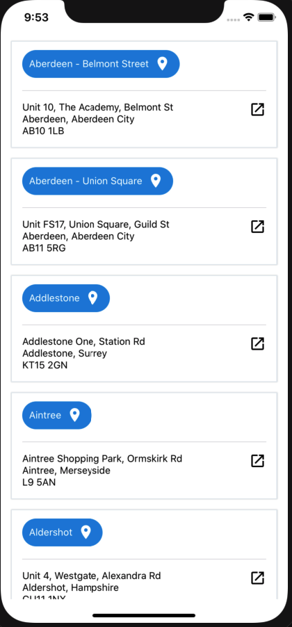

# Restaurants App
- Simple app listing out restaurants; powered by React-Native 
- Swipe down to refresh the restaurant list.
- run `npm run lint:fix` to auto fix lint errors (as much as possible).
- run `npm run coverage` to get code coverage.
- husky is used to enforce eslint during `git push`.

Setup: 

`cd restaurantsApp`

`npm install`

`cd ios`

`pod install`

To run in ios:

`cd restaurantsApp`

`npm run ios`

To run in android:

`cd restaurantsApp`

`npm run android`

To run tests:

`cd restaurantsApp`

`npm run test`
