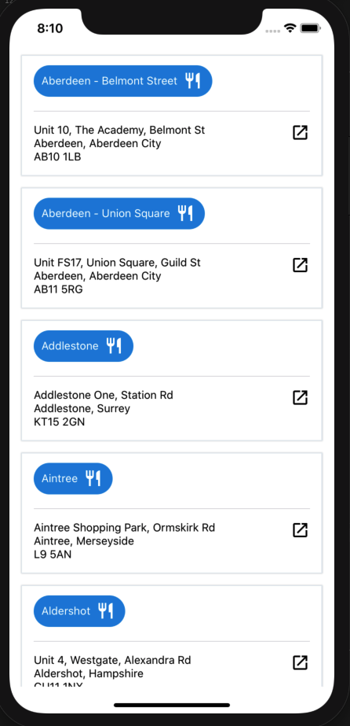

# Restaurants App

Setup: 

`cd restaurantsApp`

`npm install`

`cd ios`

`pod install`

To run in ios:

`cd restaurantsApp`

`npm run ios`

To run in android:

`cd restaurantsApp`

`npm run android`

To run tests:

`cd restaurantsApp`

`npm run test`

Note: 
- husky is used to enforce eslint during `git push`
- run `npm run lint:fix` to auto fix (as much as possible) lint errors